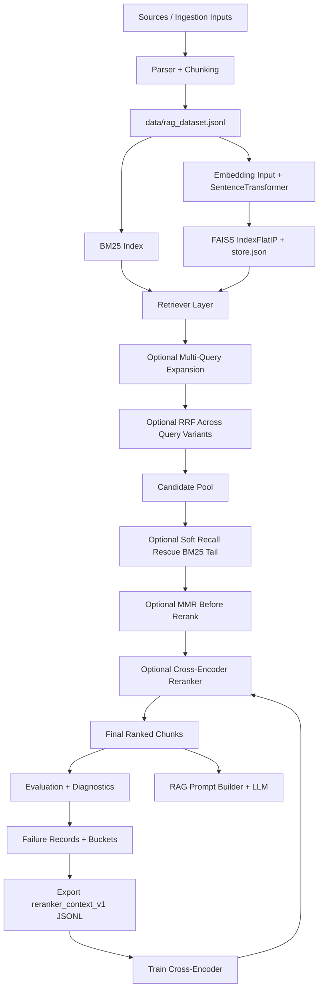
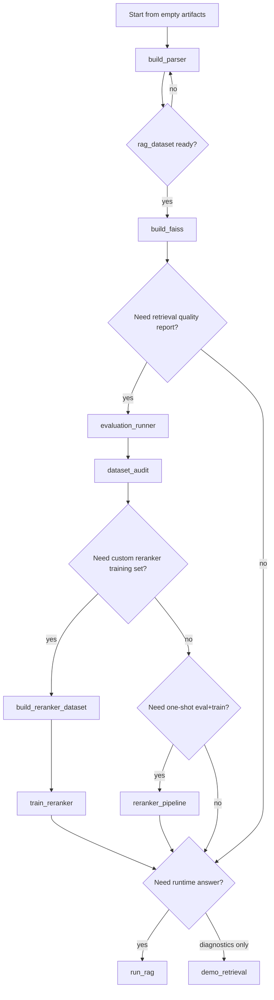

# RAG FD Architecture

## Purpose

This project is an end-to-end Retrieval-Augmented Generation (RAG) system for:
- building a chunked knowledge corpus,
- indexing it with dense embeddings + FAISS,
- retrieving with BM25 / semantic / hybrid fusion,
- improving ranking with cross-encoder reranking,
- evaluating retrieval quality and failure modes,
- exporting failure-driven reranker training data,
- retraining reranker models,
- generating grounded answers with source citations.

---

## System Diagram



---

## Core Modules

- `parser/`  
  Cleans text and chunks documents with configurable token bounds and overlap.

- `embeddings/embedder.py` and `embeddings/faiss_store.py`  
  Builds dense vectors with `SentenceTransformer`, stores vectors in FAISS (`IndexFlatIP`) and metadata in sidecar JSON.

- `retrieval/bm25.py`  
  In-memory lexical BM25 ranking over raw chunks.

- `retrieval/semantic.py`  
  Cosine-based dense retrieval over precomputed embeddings.

- `retrieval/hybrid.py`  
  Hybrid rank fusion using weighted reciprocal-rank fusion (RRF), plus optional per-source diversity limits.

- `reranking/cross_encoder.py`  
  Cross-encoder reranking with score calibration (`minmax`, `softmax`, `zscore`) and fusion with base retrieval priors.

- `evaluation/metrics.py` and `evaluation/dataset.py`  
  Metrics (`hit_rate@k`, `precision@k`, `recall@k`, `ndcg@k`, `mrr`) and evidence-linked evaluation dataset generation.

- `generation/run_rag.py`, `generation/prompt.py`, `generation/llm.py`  
  Builds grounded prompts from top chunks and queries OpenAI-compatible providers (`openai`, `gigachat`, `ollama`, `qwen`).

- `caching/lru_ttl_cache.py`  
  Generic in-memory LRU + TTL cache with periodic cleanup, access counters, and hit/miss telemetry.

- `main.py`  
  Unified orchestrator for parsing, retrieval demo, evaluation, reranker pipeline, and RAG execution.

---

## Retrieval and Ranking Formulas

## 1) BM25

For term $t$ and document $d$:

$$
\text{IDF}(t) = \log\left(1 + \frac{N - df_t + 0.5}{df_t + 0.5}\right)

\text{BM25}(q,d) = \sum_{t \in q} \text{IDF}(t)\cdot
\frac{tf_{t,d}(k_1+1)}{tf_{t,d}+k_1\left(1-b+b\frac{|d|}{avgdl}\right)}
$$

Defaults: $k_1=1.5,\; b=0.75$.

## 2) Semantic similarity (cosine)

$$
\cos(\mathbf{q}, \mathbf{d}) = \frac{\mathbf{q}\cdot\mathbf{d}}{\|\mathbf{q}\|\|\mathbf{d}\|}
$$

Embeddings are normalized; FAISS uses inner product, so IP ~= cosine.

## 3) Hybrid RRF fusion

Per branch rank contribution:

$$
\text{RRF}(r)=\frac{1}{k_{rrf}+r}
$$

Combined hybrid score:

$$
S_{\text{hybrid}}(d)=\alpha\cdot\text{RRF}_{\text{semantic}}(d) + (1-\alpha)\cdot\text{RRF}_{\text{bm25}}(d)
$$

## 4) Multi-query RRF

If query variants produce ranks $r_i(d)$:

$$
S(d)=\sum_i \frac{1}{k_{rrf}+r_i(d)}
$$

## 5) MMR (diversification before rerank)

$$
\underset{d \in C \setminus S}{\arg\max}
\left[
\lambda\cdot\text{Rel}(q,d) - (1-\lambda)\cdot\max_{s \in S}\text{Sim}(d,s)
\right]
$$

## 6) Cross-encoder fusion

After CE calibration and base-score normalization:

$$
S_{\text{final}}(d)=\alpha_{ce}\cdot CE_{\text{norm}}(d)+(1-\alpha_{ce})\cdot Base_{\text{norm}}(d)
$$

Calibration options:
- `minmax`
- `softmax` with temperature $T$: $\text{softmax}(z/T)$
- `zscore` + sigmoid: $\sigma((z-\mu)/(\sigma T))$

---

## Evaluation Metrics

For a query with `TopK` and `Relevant`:

- Recall@k: $$\frac{|TopK \cap Relevant|}{|Relevant|}$$
- Precision@k: $$\frac{|TopK \cap Relevant|}{k}$$
- HitRate@k: $$\mathbb{1}[TopK \cap Relevant \neq \emptyset]$$
- Reciprocal Rank: $$RR = \frac{1}{\text{rank of first relevant}}$$
- MRR: average of RR across queries.
- DCG@k: $$\sum_{i=1}^{k}\frac{2^{rel_i}-1}{\log_2(i+1)}$$
- NDCG@k: $$\frac{DCG@k}{IDCG@k}$$
---

## Advanced Features

- Multi-query expansion:
  - rule-based layers (paraphrase + decomposition + entity/concept),
  - optional LLM structured expansions,
  - optional batched pre-generation for all queries in one upfront request.

- Failure analysis:
  - buckets: `near_miss`, `fragmentation`, `ranking_cutoff_failure`, `true_recall_failure`,
  - source miss attribution: `embedding_miss`, `bm25_miss`, `both_miss`, `both_hit`,
  - manual inspection sample export in report JSON.

- Failure-driven reranker training:
  - exports `reranker_context_v1` with positives, negatives, and per-negative weights,
  - rank-aware weighting and bucket-aware weighting for hard negatives,
  - in-loop training option from `main.py reranker_pipeline`.

- Caching subsystem:
  - retrieval-side cache for repeated query/top-k lookups in evaluation pipelines,
  - LLM response cache for query expansion and `run_rag`,
  - LRU eviction + TTL expiry + periodic cleanup to balance memory usage and freshness.

- Observability and runtime logging:
  - centralized runtime logger configuration (`log level`, `text/json`, optional file sink),
  - stage-level `INFO` logs for retrieval/evaluation/RAG execution flow,
  - `WARNING` for risky conditions (e.g., filtered datasets, empty context),
  - `ERROR` logs with stack traces on failures.

---

## Operational Entrypoints

Use:

```bash
python main.py --help
```

Primary commands:
- `build_parser`
- `build_faiss`
- `demo_retrieval`
- `evaluation_runner`
- `reranker_pipeline`
- `run_rag`
- `cleanup_faiss`

Recommended full loop:

> Note: below uses `poetry run python` for reproducible environment resolution.

### 0) Build parser dataset (`build_parser`)

```bash
poetry run python main.py build_parser \
  --output data/rag_dataset.jsonl \
  --min-tokens 100 \
  --max-tokens 140 \
  --overlap-ratio 0.18 \
  --min-output-chunk-tokens 60 \
  --max-output-chunk-tokens 750 \
  --max-chunks-per-url 10 \
  --max-chunks-per-category 45 \
  --embedding-model intfloat/e5-base-v2
```

What it does:
- Parses configured sources, cleans text, chunks content, and writes unified dataset.

What it prints:
- JSON stats summary (chunking/parser counters).

Files generated:
- `data/rag_dataset.jsonl`

### 1) Build FAISS index (`build_faiss`)

```bash
poetry run python main.py build_faiss \
  --prepare-input \
  --rag-dataset data/rag_dataset.jsonl \
  --input-jsonl data/embeddings_input.jsonl \
  --faiss-path data/faiss \
  --index . \
  --embedding-model intfloat/e5-base-v2
```

What it does:
- Optionally prepares embedding input from RAG dataset, encodes chunks, and persists FAISS index.

What it prints:
- JSON summary with `prepared_rows`, `indexed_rows`, and index settings.

Files generated:
- `data/embeddings_input.jsonl`
- `data/faiss/./vectors.index`
- `data/faiss/./store.json`

### 2) Run retrieval benchmark (`evaluation_runner`)

```bash
poetry run python main.py evaluation_runner \
  --dataset data/evaluation_with_evidence.jsonl \
  --retriever hybrid \
  --k-values 1,3,5,10,20,30 \
  --alpha 0.65 \
  --rag-dataset data/rag_dataset.jsonl \
  --faiss-path data/faiss \
  --index . \
  --embedding-model intfloat/e5-base-v2 \
  --ce-calibration zscore \
  --ce-temperature 1.0 \
  --hybrid-candidate-multiplier 100 \
  --hybrid-rrf-k 80 \
  --rerank \
  --rerank-candidates 120 \
  --rerank-alpha 0.30 \
  --rerank-semantic-weight 0.70 \
  --rerank-bm25-weight 0.30 \
  --reranker-model cross-encoder/ms-marco-MiniLM-L-6-v2 \
  --out-json experiments/results/retrieval_report_best.json
```

What it does:
- Evaluates retrieval quality over evaluation dataset with hybrid + rerank pipeline.

What it prints:
- Metric report (`hit_rate@k`, `recall@k`, `ndcg@k`, `mrr`, etc.) and failure diagnostics.

Files generated:
- `experiments/results/retrieval_report_best.json`

### 3) Audit dataset quality (`dataset_audit`)

```bash
poetry run python main.py dataset_audit \
  --rag data/rag_dataset.jsonl \
  --eval data/evaluation_with_evidence.jsonl \
  --out data/dataset_audit_report.json
```

What it does:
- Audits RAG/eval coverage balance and concentration metrics.

What it prints:
- Audit JSON report to stdout.

Files generated:
- `data/dataset_audit_report.json`

### 4) Export failure-driven reranker dataset (`build_reranker_dataset`)

```bash
poetry run python main.py build_reranker_dataset \
  --eval-report experiments/results/retrieval_report_best.json \
  --rag-dataset data/rag_dataset.jsonl \
  --out data/reranker_train.jsonl
```

What it does:
- Converts failed retrieval cases into weighted reranker training contexts.

What it prints:
- Context count and build stats.

Files generated:
- `data/reranker_train.jsonl`

### 5) Train reranker (`train_reranker`)

```bash
poetry run python main.py train_reranker \
  --train-jsonl data/reranker_train.jsonl \
  --rag-dataset data/rag_dataset.jsonl \
  --model BAAI/bge-reranker-v2-m3 \
  --out-dir /tmp/reranker-bge-m3 \
  --epochs 5 \
  --batch-size 16 \
  --warmup-steps 100 \
  --val-ratio 0.05
```

What it does:
- Trains cross-encoder reranker on exported pair/context samples.

What it prints:
- Training result JSON (`out_dir`, train/val counts, model).

Files generated:
- `/tmp/reranker-bge-m3` (trained model directory)

### 6) One-shot integrated loop (`reranker_pipeline`)

```bash
poetry run python main.py reranker_pipeline \
  --dataset data/evaluation_with_evidence.jsonl \
  --rag-dataset data/rag_dataset.jsonl \
  --faiss-path data/faiss \
  --index . \
  --embedding-model intfloat/e5-base-v2 \
  --reranker-model cross-encoder/ms-marco-MiniLM-L-6-v2 \
  --k-values 1,3,5,10,20,30 \
  --export-reranker-train-jsonl data/reranker_train.jsonl \
  --train-reranker \
  --train-reranker-model BAAI/bge-reranker-v2-m3 \
  --train-reranker-out-dir /tmp/reranker-bge-m3 \
  --train-reranker-epochs 5 \
  --train-reranker-batch-size 16 \
  --train-reranker-warmup-steps 100 \
  --train-reranker-val-ratio 0.05
```

What it does:
- Runs evaluation + failure analysis + dataset export + optional reranker training in one command.

What it prints:
- Evaluation metrics, failure buckets, export info, optional training output path.

Files generated:
- `experiments/results/...` (if configured via defaults)
- `data/reranker_train.jsonl`
- `/tmp/reranker-bge-m3` (when `--train-reranker` is enabled)

### 7) Run end-user RAG answer (`run_rag`)

```bash
poetry run python main.py run_rag \
  --question "what is ingestion" \
  --provider qwen \
  --model qwen-plus \
  --embedding-model intfloat/e5-base-v2
```

What it does:
- Retrieves top chunks, optionally reranks, builds grounded prompt, queries selected LLM provider.

What it prints:
- Used source IDs and final generated answer (streaming/non-streaming).

Files generated:
- None by default (unless logging/output defaults are configured).

### 8) Inspect retrieval stack only (`demo_retrieval`)

```bash
poetry run python main.py demo_retrieval \
  --query "test retrieval" \
  --model intfloat/e5-base-v2 \
  --rerank \
  --reranker-model cross-encoder/ms-marco-MiniLM-L-6-v2
```

What it does:
- Prints BM25 vs semantic vs hybrid retrieval diagnostics; optionally CE-reranked output.

What it prints:
- Ranked lists with scores and text previews by retrieval stage.

Files generated:
- None.

### Full flow graph (from zero)



---

## Documentation Map

- `README.md`  
  Project quickstart and current "best/stable" execution flow.

- `docs/features-catalog.md`  
  Full feature inventory by category (commands, FAISS management, caching, reranking, logging, artifacts).

- `docs/handbook.md`  
  Primary command handbook with practical variants, including evaluation runner modes.

- `scripts/run_best_eval.sh`  
  Reproducible stable pipeline script used as the source-of-truth run for benchmark outputs.

